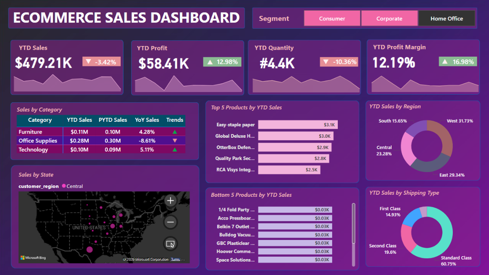

# Ecommerce Sales Dashboard

A modern, interactive sales analytics dashboard built with Microsoft Power BI. This project visualizes ecommerce data to help you understand sales trends, customer behavior, and product performance.

## Technology Used

- **Microsoft Power BI** for dashboard design and visualization
- **MS SQL Server** for data storage and management
- **DAX (Data Analysis Expressions)** for advanced calculations and data modeling

## Features

- **Sales Overview:** Track revenue, orders, and growth over time
- **Customer Insights:** Segment and analyze customer demographics and behavior
- **Product Analytics:** Identify top-performing products and categories
- **Geographical Analysis:** Visualize sales distribution by region
- **Interactive Filters:** Drill down into data with slicers and filters

## Getting Started

1. Download the [`Ecommerce Sales Dashboard.pbix`](Ecommerce%20Sales%20Dashboard.pbix) file.
2. Open it in [Microsoft Power BI Desktop](https://powerbi.microsoft.com/desktop/).
3. Connect your own data source if needed, or explore with the sample data.

## Screenshots

